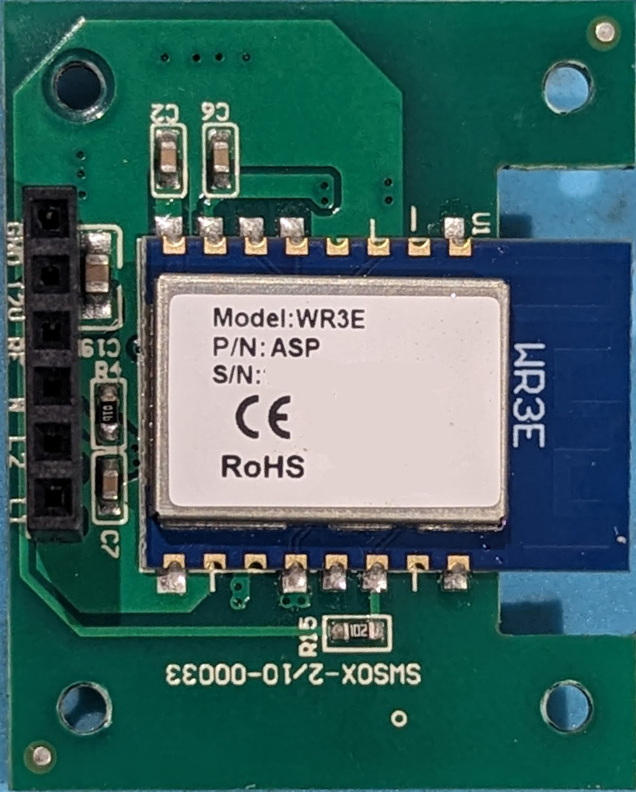
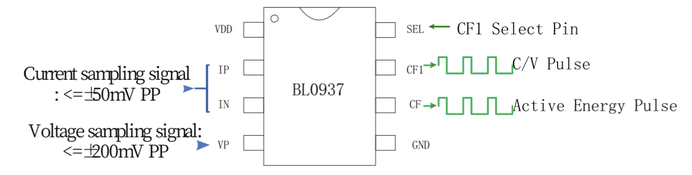
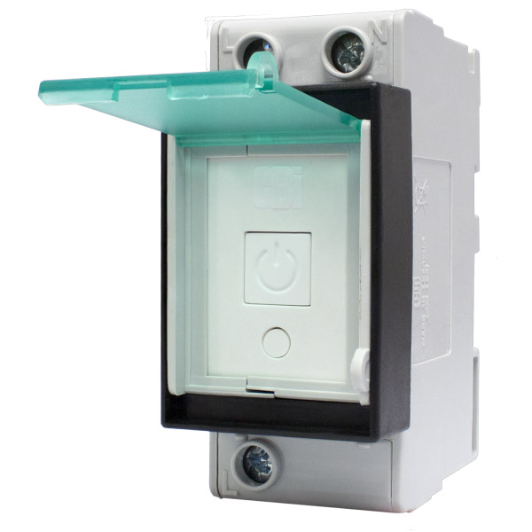
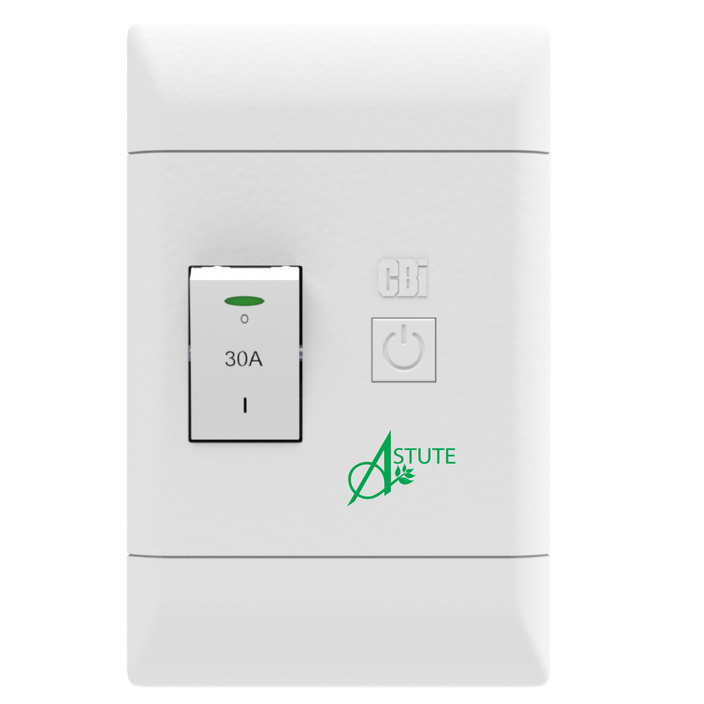
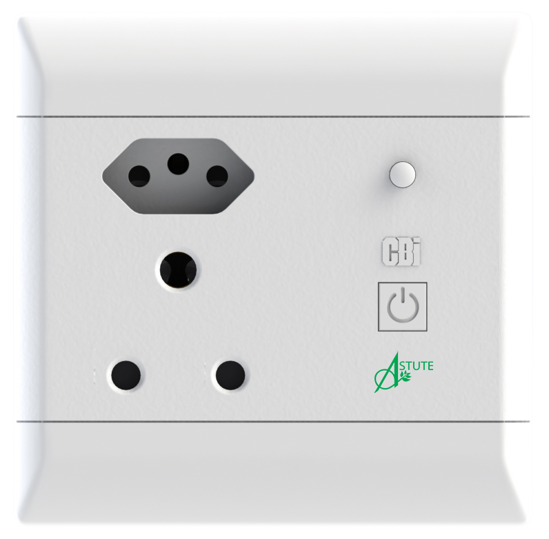

# CBI

## WR3E

https://docs.libretiny.eu/boards/wr3e/

Do enter [download mode](https://docs.libretiny.eu/docs/platform/realtek-ambz/#flashing), first bridge `TX2` to `GND` and then connect `GND` to the FTDI adapter.  Once powered, disconnect `TX2` from `GND`.

## CBI Astute Smart Controller

<a href="astute-smart-controller/CBI ASC Data Sheet.pdf">Data Sheet</a>

## CBI Astute Smart Isolator

<a href="astute-smart-isolator/CBI ASI Data Sheet.pdf">Data Sheet</a>

## CBI Astute Smart Plug

<a href="astute-smart-plug/CBI ASP Data Sheet.pdf">Data Sheet</a>

