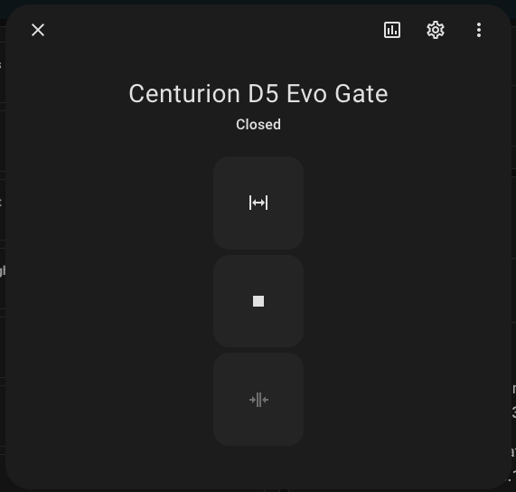
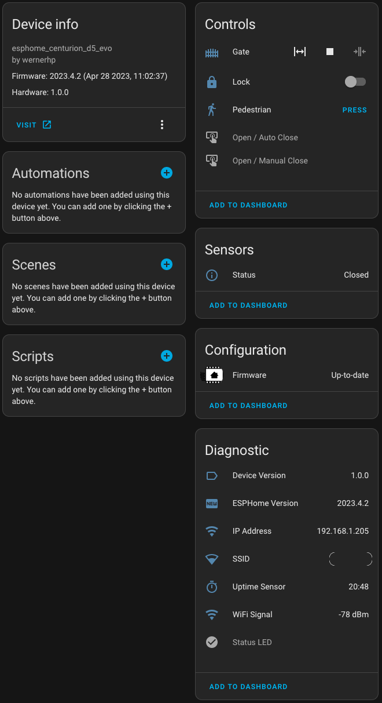

# esphome.centurion_d5_evo
Control your Centurion D5 Evo gate motor remotely with Bluetooth Proxy support.

## Features
- **Bluetooth Proxy**: Extends Home Assistant's Bluetooth reach through this ESP32
- **OTA Updates**: Over-the-air firmware updates with fallback support
- **Safe Mode**: Automatic recovery after failed boots
- **Web Server**: Local web interface for configuration and control
- **Fallback AP**: Creates a hotspot if WiFi connection fails

## Hardware
- **Board**: ESP32-D0WD-V3 (Dual Core, 240MHz)
- **Flash**: 4MB
- **Crystal**: 40MHz

## Partition Layout
Custom partition table optimized for OTA with Bluetooth:
| Partition | Type    | Size    |
|-----------|---------|---------|
| nvs       | data    | 20KB    |
| otadata   | data    | 8KB     |
| app0      | ota_0   | 1.75MB  |
| app1      | ota_1   | 1.75MB  |
| nvs_key   | data    | 4KB     |
| coredump  | data    | 64KB    |

## Installation

### First-time Flash (via USB)
```bash
esphome run centurion-d5-evo.yaml
```

### OTA Update
Updates can be performed via:
1. ESPHome Dashboard
2. Home Assistant
3. Web interface at device IP

## Secrets Required
Add these to your `secrets.yaml`:
```yaml
wifi_iot_ssid: "YourWiFiSSID"
wifi_iot_password: "YourWiFiPassword"
api_encryption_key: "GeneratedBase64Key"
ota_password: "YourOTAPassword"
```

Generate an API encryption key with:
```bash
openssl rand -base64 32
```





